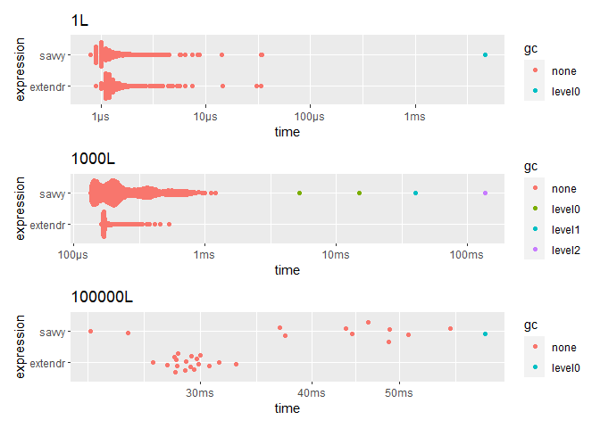

<!-- README.md is generated from README.Rmd. Please edit that file -->

# Benchmark savvy vs extendr

<!-- badges: start -->
<!-- badges: end -->

## Int input

``` r
bench_int_input <- function(x) {
  label <- rlang::as_label(rlang::enexpr(x))
  x <- force(x)
  results = bench::mark(
    "extendr (Integers)" = extendrPkg::int_input(x),
    "extendr (Vec<i32>)" = extendrPkg::int_input_vec(x),
    "savvy"              = savvyPkg::int_input(x)
  )
  
  ggplot2::autoplot(results) + ggtitle(label)
}

p1 <- bench_int_input(1L)
#> Loading required namespace: tidyr
p2 <- bench_int_input(1L:1000L)
p3 <- bench_int_input(1L:100000L)

p1 / p2 / p3
```

<!-- -->

## Int output

``` r
bench_int_output <- function(x) {
  label <- rlang::as_label(rlang::enexpr(x))
  x <- force(x)
  results = bench::mark(
    extendr = extendrPkg::int_output(x),
    savvy   = savvyPkg::int_output(x)
  )
  
  ggplot2::autoplot(results) + ggtitle(label)
}

p1 <- bench_int_output(1L)
p2 <- bench_int_output(1000L)
p3 <- bench_int_output(100000L)

p1 / p2 / p3
```

<!-- -->

## String input

savvy is slow because it uses `Rf_translateCharUTF8()`.

``` r
bench_str_input <- function(x) {
  label <- rlang::as_label(rlang::enexpr(x))
  x <- force(x)
  results = bench::mark(
    extendr = extendrPkg::str_input(x),
    savvy   = savvyPkg::str_input(x)
  )
  
  ggplot2::autoplot(results) + ggtitle(label)
}

p1 <- bench_str_input("a")
p2 <- bench_str_input(as.character(1:1000))
p3 <- bench_str_input(as.character(1:100000))

p1 / p2 / p3
```

<!-- --> \## String
output

``` r
bench_str_output <- function(x) {
  label <- rlang::as_label(rlang::enexpr(x))

  x <- force(x)
  results = bench::mark(
    extendr = extendrPkg::str_output(x),
    savvy   = savvyPkg::str_output(x)
  )
  
  ggplot2::autoplot(results) + ggtitle(label)
}

p1 <- bench_str_output(1L)
p2 <- bench_str_output(1000L)
p3 <- bench_str_output(100000L)

p1 / p2 / p3
```

<!-- -->
