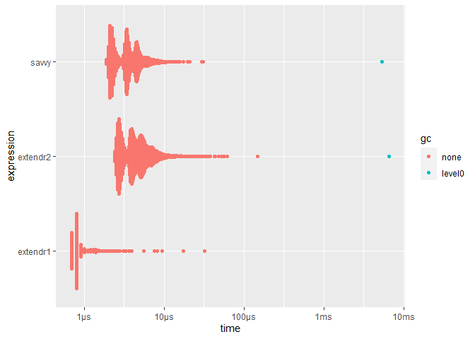
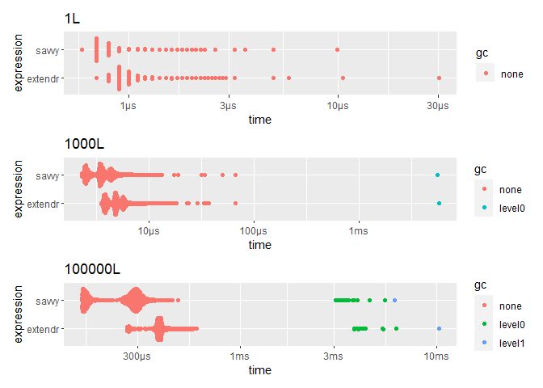
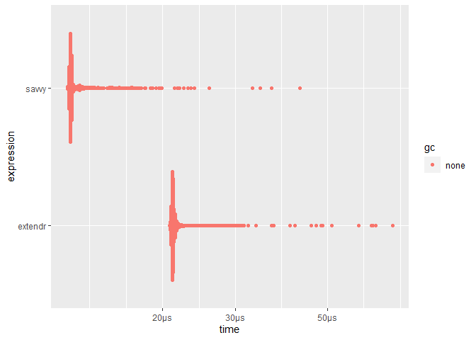
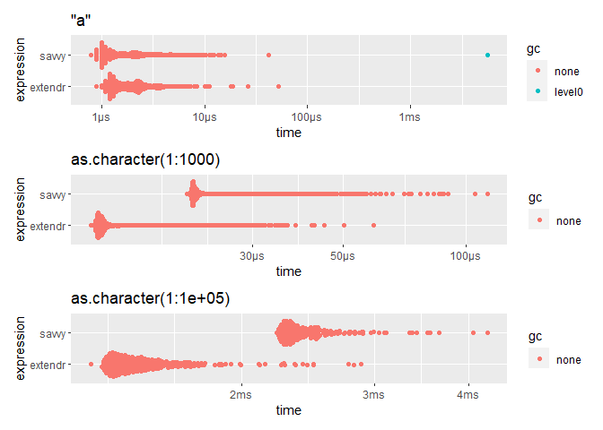
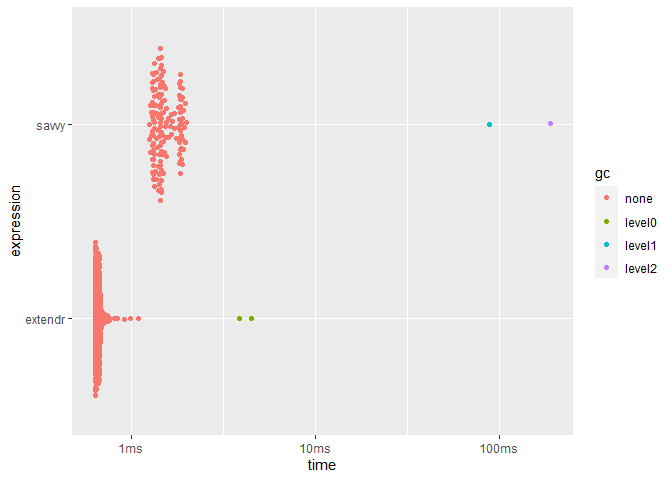

<!-- README.md is generated from README.Rmd. Please edit that file -->

# Benchmark savvy vs extendr

<!-- badges: start -->
<!-- badges: end -->

## Identity

``` r
bench_identity <- function(x) {
  x <- force(x)
  results = bench::mark(
    extendr1 = extendrPkg::identity_int1(x),
    extendr2 = extendrPkg::identity_int2(x),
    savvy    = savvyPkg::identity_int1(x)
  )
  
  ggplot2::autoplot(results)
}

bench_identity(1L)
#> Loading required namespace: tidyr
```

<!-- -->

``` r
bench_identity(1L:1000L)
```

<!-- -->

## Sum

``` r
bench_sum <- function(x) {
  x <- force(x)
  results = bench::mark(
    extendr = extendrPkg::sum_int(x),
    savvy   = savvyPkg::sum_int(x)
  )
  
  ggplot2::autoplot(results)
}

bench_sum(1L)
```

<!-- -->

``` r
bench_sum(1L:10000L) # ALTREP
```

<!-- -->

``` r
bench_sum(rep(1L, 10000)) # non-ALTREP
```

<!-- -->

## String conversion

``` r
bench_to_upper <- function(x) {
  x <- force(x)
  results = bench::mark(
    extendr = extendrPkg::to_upper(x),
    savvy   = savvyPkg::to_upper(x)
  )
  
  ggplot2::autoplot(results)
}

bench_to_upper("a")
```

<!-- -->

``` r
bench_to_upper(letters)
```

<!-- -->

``` r
bench_to_upper(rep("a", 10000))
```

<!-- -->
